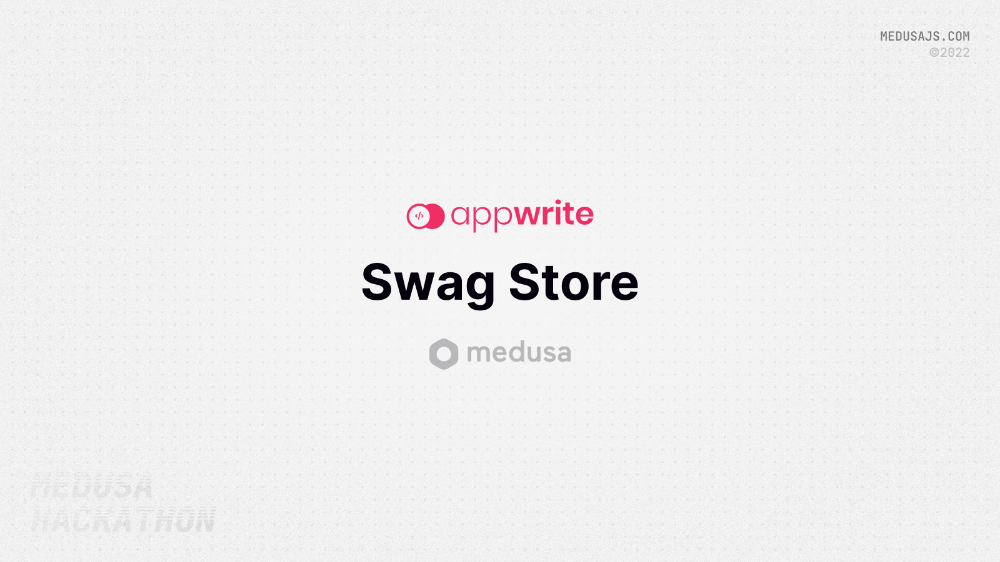
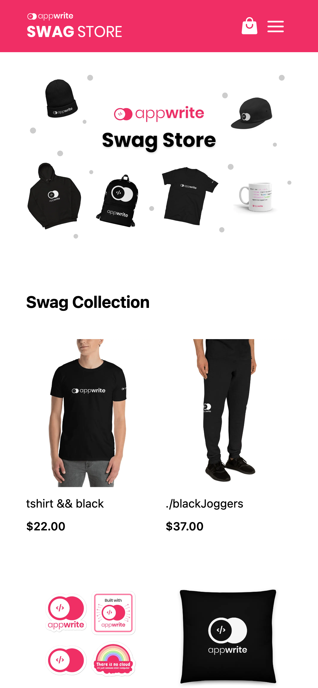
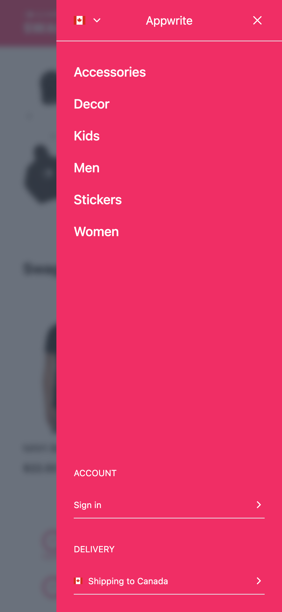
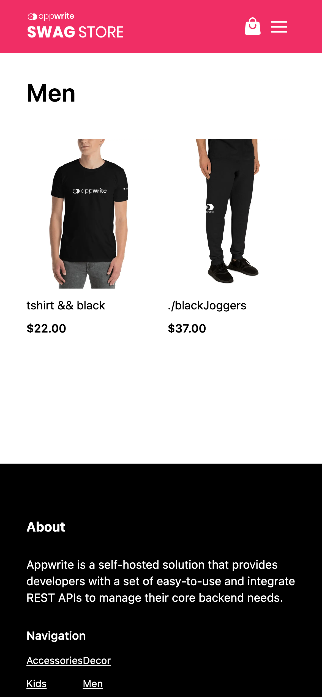
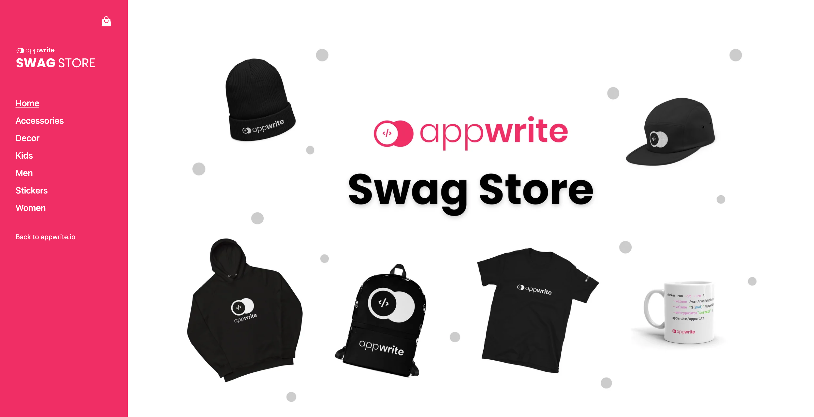
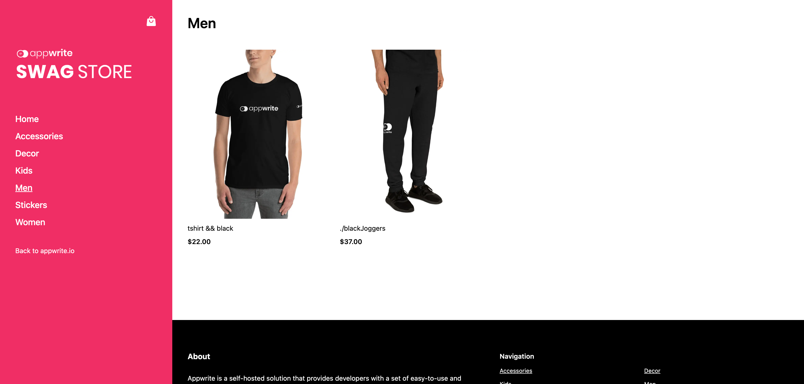

# Medusa Appwrite Store



## About

### Participants

#### Steven

- GitHub - @stnguyen90
- Twitter - @stnguyen90
- Discord - BalistarDrake#3823

### Description

This is a demo of the [Appwrite Swag Store](https://store.appwrite.io/) built using Medusa, an open source e-commerce platform.

### Preview

#### Mobile







#### Desktop





## Set up Project

### Prerequisites

Make sure you have the following installed:

- [Node.js](https://nodejs.org/en/) v14 or greater installed on your machine

### Install Project

1. **Install Medusa CLI**

   ```bash
   npm install -g @medusajs/medusa-cli
   ```

2. **Seed the backend**

   ```bash
   cd backend
   medusa seed -f ./data/seed.json
   ```

3. **Start the backend**

   ```bash
   medusa develop
   cd ..
   ```

4. **Start the admin console**

   ```bash
   cd admin
   npm i
   npm start
   cd ..
   ```

5. **Create the following collections and add the relevant products:**

   1. Women
      - handle: women
      - products
        - appwrite-womens-joggers
   2. Men
      - handle: men
      - products
        - appwrite-mens-joggers
        - appwrite-mens-t-shirt-v2
   3. Kids
      - handle: kids
      - products
        - baby-short-sleeve-one-piece
   4. Stickers
      - handle: stickers
      - products
        - appwrite-sticker-pack
   5. Accessories
      - handle: accessories
      - products
        - coffee-mug
   6. Decor
      - handle: decor
      - products
        - appwrite-throw-pillow-black-center

6. **Start the storefront**

   ```bash
   cd storefront
   cp .env.template .env.local
   npm i
   npm run dev
   ```

## Usage

### Admin

Browse to http://localhost:7000/ and login with:

- Email: admin@appwrite.io
- Password: supersecret

### Storefront

Browse to http://localhost:8000/.
